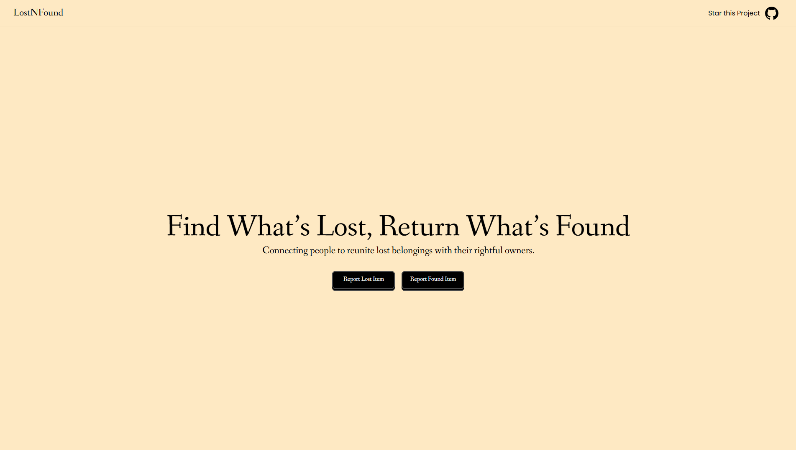
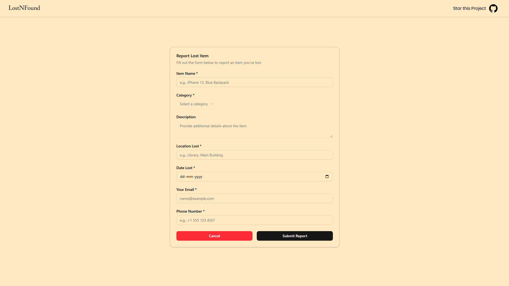

# 🕵️‍♂️ LostNFound — Lost & Found Platform  

A full-stack **Lost and Found management system** built with a **microservices architecture** and deployed on **Azure Container Apps**.  
Users can **report lost or found items**, browse listings, and get notified when matches are found.

---

## 🌐 Overview  

LostNFound helps individuals and institutions easily manage lost and found reports with a user-friendly interface and a robust, scalable backend.  

The system follows a **microservices architecture** for better scalability and maintainability.

---

## 🖼️ Project Preview  

> 🧭 **Home Page**  
>  
>   

> 📋 **Lost & Found Listings**  
>  
>   

> 📨 **Report Item Flow**  
>  
>   

---

## ⚙️ Architecture  

**Frontend:** React  
**Backend:** Node.js (Express Microservices)  
**Database:** PostgreSQL  
**Deployment:** Azure Container Apps  
**Authentication:** JWT  
**Email Delivery:** Nodemailer + SMTP  

### 🧩 Microservices  

| Service | Description | Port |
|----------|--------------|------|
| **api-gateway** | Entry point that proxies requests to auth and items services | 8080 |
| **auth-service** | Handles user registration, login, and JWT verification | 4001 |
| **items-service** | Manages lost/found items and sends email notifications | 4002 |
| **postgres** | Central PostgreSQL instance | 5432 |

---

## 🧠 Features  

- 🔐 **JWT-based authentication**  
- 🧾 **Lost/Found item management** (report, list, search, filter)  
- 📨 **Email notifications** when items are reported or found  
- 🧩 **Modular microservice design** (Auth, Items, Gateway)  
- ☁️ **Azure-ready deployment** with Terraform support  
- 🐳 **Dockerized local development** with PostgreSQL  

---
